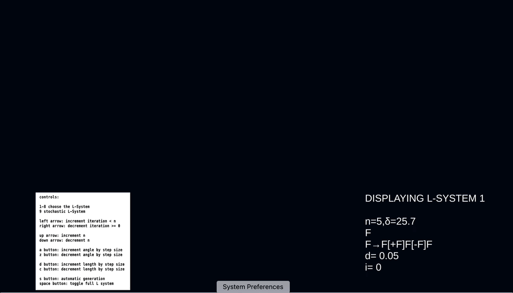

# l-system
System that allows you to view/modify 9 pre-loaded L-Systems. More of your choosing can be added through the Unity inspector. All code is translated from pure math by me. 

[Try it here] (https://shahd-s.itch.io/l-system)

